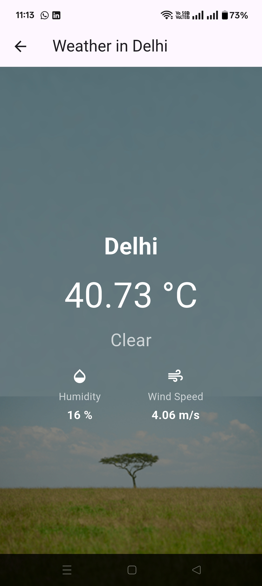

## WeatherNow

A new Flutter project.

## 📸 Screenshots

### Home Screen

### Weather Screen

## 🎬 Demo Video

## About Me
### Aditya Prabhakar
### 240107003
### WeatherNow is a simple Flutter app that fetches and displays the current weather of any city using the OpenWeatherMap API. The app allows users to search for a city, select from popular cities, or (optionally) use their current location to view local weather. It features a clean UI, background images, and displays key weather details such as temperature, weather condition, humidity, and wind speed.
